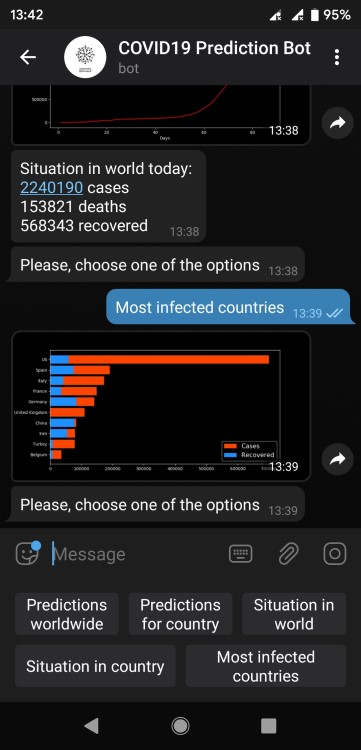

# covid_predict

Telegram Bot predicting coronavirus spread by using different fitting methods. Fitting types include:

* Polynomial fitting
* S-shape curve fitting
* Exponential curve fitting

Bot file telegram_bot.py is created using Telebot library for Telegram bots. Functions are created in covid_predict.py including not only predictive functions, but also providing statistics and visualizations.

  